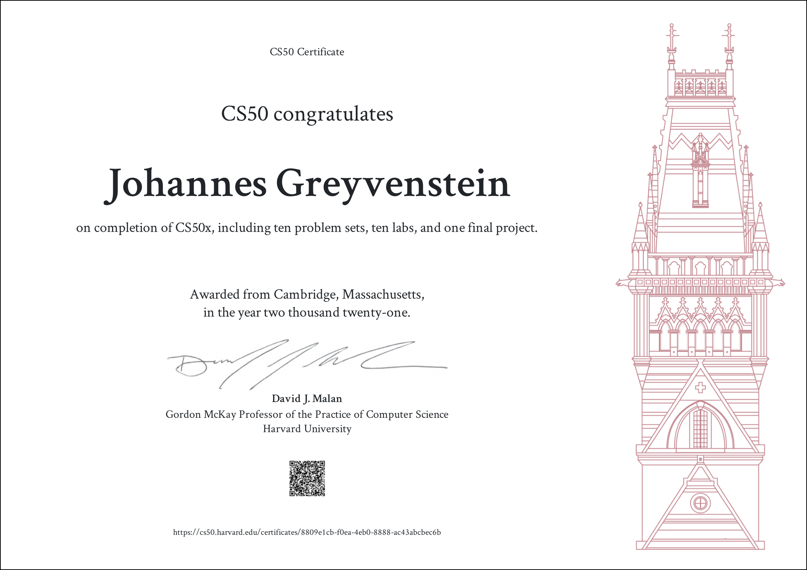

CS50 problem sets and labs: https://cs50.harvard.edu/x/2021/ \
Contents as per my submissions:
* [labs](labs/)
  * [lab 1 - hello](labs/lab1/hello/hello.c)
  * [lab 1 - population](labs/lab1/population/population.c)
  * [lab 2 - scrabble](labs/lab2/scrabble.c)
  * [lab 3 - answers](labs/lab3/answers.txt)
  * [lab 4 - volume](labs/lab4/volume.c)
  * [lab 5 - inheritance](labs/lab5/inheritance.c)
  * [lab 6 - tournament](labs/lab6/tournament.py)
  * [lab 7 - songs](labs/lab7/)
  * [lab 8 - trivia](labs/lab8/)
  * [lab 9 - Birthdays](labs/lab9/)
* [problem sets](problemSets/)
  * [pset 1 - cash](problemSets/pset1/cash/cash.c)
  * [pset 1 - credit](/problemSets/pset1/credit/credit.c)
  * [pset 1 - mario](/problemSets/pset1/mario/)
    * [less](/problemSets/pset1/mario/less/mario.c)
    * [more](/problemSets/pset1/mario/more/mario.c)
  * [pset 2 - caesar](/problemSets/pset2/caesar/caesar.c)
  * [pset 2 - readability](/problemSets/pset2/readability/readability.c)
  * [pset 3 - plurality](/problemSets/pset3/plurality/plurality.c)
  * [pset 3 - runoff](/problemSets/pset3/runoff/runoff.c)
  * [pset 4 - filter](/problemSets/pset4/filter/less/) 
  * [pset 4 - recover](/problemSets/pset4/recover/)
  * [pset 5 - speller](/problemSets/pset5/speller/)
  * [pset 6 - hello](/problemSets/pset6/hello/hello.py)
  * [pset 6 - cash](/problemSets/pset6/cash/cash.py)
  * [pset 6 - credit](/problemSets/pset6/credit/credit.py)
  * [pset 6 - mario](/problemSets/pset6/mario/)
    * [less](/problemSets/pset6/mario/less/mario.py)
    * [more](/problemSets/pset6/mario/more/mario.py)
  * [pset 6 - readability](/problemSets/pset6/readability/readability.py)
  * [pset 6 - DNA](/problemSets/pset6/dna/)
  * [pset 7 - fiftyville](/problemSets/pset7/fiftyville/)
  * [pset 7 - movies](/problemSets/pset7/movies/)
  * [pset 8 - homepage](/problemSets/pset8/homepage/)
  * [pset 9 - finance](/problemSets/pset9/finance/)
* [Final Project](https://github.com/Lodewikes/vGhostingAndroid.git)

